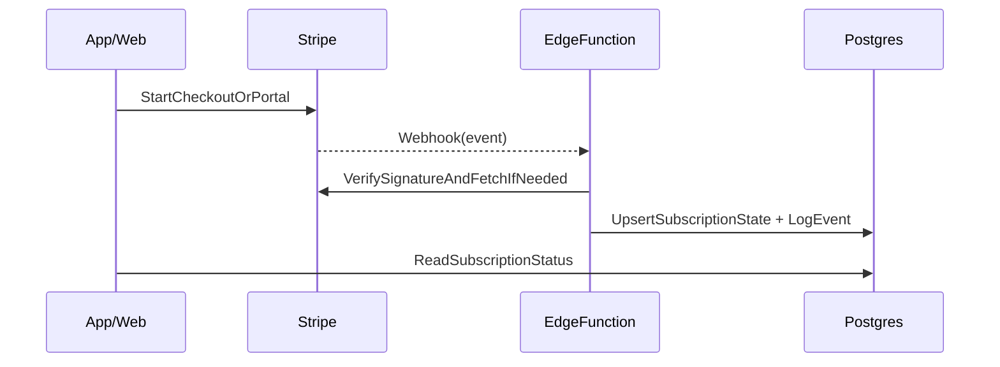

# Billing (Stripe) — Assinatura, Cancelamento e Webhooks

Este documento descreve o desenho de billing para o MVP: assinatura recorrente do personal com Stripe e **status de acesso controlado pelo backend**.

## Objetivos
- Assinatura recorrente (R$30/mês ou variação) para personal.
- Atualização confiável de status via webhooks.
- Idempotência e auditoria para evitar estados inconsistentes.

## Entidades internas (recomendado)
Mesmo usando Stripe, manter o estado no seu banco:
- `profiles.stripe_customer_id`
- `profiles.stripe_subscription_id`
- `profiles.subscription_status` (`active` | `canceled` | `pending` | `past_due`)
- `profiles.subscription_current_period_end`

Opcional (mas recomendado): tabela `billing_events` para logar webhooks.

## Fluxo (alto nível)

## Webhooks mínimos (MVP)
- `invoice.paid`: marca como `active`
- `invoice.payment_failed`: marca como `past_due` (e orientar UX)
- `customer.subscription.deleted`: marca como `canceled`

## Regras de idempotência (obrigatórias)
- Persistir `stripe_event_id` em `billing_events`.
- Se `stripe_event_id` já foi processado, **retornar 200** e não reprocessar.

## Logs/auditoria (mínimo)
Registrar:
- `event_id`
- `event_type`
- `customer_id`
- `subscription_id`
- `received_at`
- `applied_at`
- `result` (ok/erro + mensagem)

## Cancelamento (produto)
Recomendação para MVP:
- Cancelar “no fim do período” (padrão Stripe) para reduzir fricção e suporte.
- Fluxo de retenção no app/web (ex.: oferta de 1 mês, downgrade, pausa).

## Enforcement de acesso
O backend precisa garantir:
- Personal sem `subscription_status=active` não consegue executar ações críticas (criar treino, atribuir treino, etc.).
- O app deve refletir isso visualmente, mas a regra final é no servidor.

## Porta de saída (trocar provedor)
Para reduzir lock-in:
- Criar um contrato interno “BillingService” com operações:
  - `startSubscription()`
  - `cancelSubscription()`
  - `getStatus()`
  - `handleWebhook(event)`
- Assim, Stripe/Asaas/etc. ficam como adaptadores.

