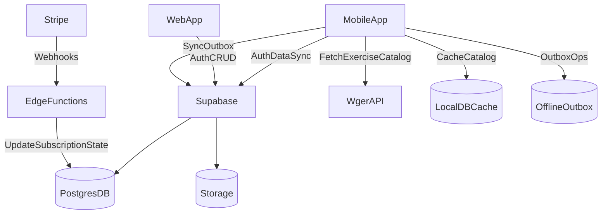

# Planejamento — Ferramentas, Tecnologias e Arquitetura (Actus Fit)

**Última atualização:** 2026-04-21  
**Objetivo:** lançar um MVP com **baixo custo** e **alta velocidade de entrega**, validando com público pequeno, sem criar lock-in desnecessário e com caminho claro de evolução.

## Contexto (resumo do MVP)

Baseado em `scope.md`, `project.md` e `PRD-MVP-REVISED.md`, o MVP tem 3 pilares que influenciam diretamente a arquitetura:

- **B2B2C com 2 perfis**: Personal e Aluno
- **Vinculação por convite**: aluno entra via código do personal
- **Mobile-first (academia) + offline-first**: personal cria/atribui treino em tempo real; aluno executa e marca exercícios; sincroniza depois
- **Pagamento recorrente + webhooks**: assinatura do personal e controle de acesso
- **Catálogo de exercícios**: busca via Wger com cache/fallback

## Princípios de decisão (anti-arrependimento)

- **Separar domínio de fornecedor**: o domínio (treino, execução, progresso, billing) não deve “vazar” Supabase/Stripe para dentro da lógica central do app.
- **Backend é fonte de verdade**: o device opera offline, mas o estado final fica consistente no servidor.
- **Billing é server-side**: nunca liberar acesso crítico apenas por “flag do app”; o backend valida assinatura e aplica políticas.
- **Gamificação/progresso por eventos**: guardar histórico mínimo (append-only) para recalibrar regras sem perder rastreabilidade.

---

## Escolha de stack (recomendação)

### Recomendação (MVP): Mobile cross-platform + Supabase (Postgres) + Stripe

- **Backend/BaaS:** Supabase
  - Postgres (relacional facilita progresso, histórico, relatórios e auditoria)
  - Auth (sessões, tokens)
  - Storage (fotos/vídeos futuros)
  - Edge Functions (webhooks Stripe, rotinas de convite, regras que não podem rodar no client)
- **Pagamentos:** Stripe (Subscriptions/Checkout + Webhooks)
- **Exercícios:** Wger API + cache local + fallback mínimo
- **Web (fase 1.5/2):** painel do personal (tablet/desktop) consumindo o mesmo backend

### “Flutter vs React Native” (decisão agora, sem travar o futuro)

O projeto precisa de um **framework mobile**; a escolha deve seguir competência do time e risco de prazo:

- **Se o time é mais forte em JS/TS**: **React Native** tende a acelerar entrega/contratação.
- **Se o diferencial de UX/animação (gamificação) for crítico** e você aceita curva: **Flutter** tende a ser superior.

**Independente da escolha**, o que protege o futuro é manter:

- camadas de domínio e repositórios bem definidos
- estratégia offline/sync bem desenhada desde o início
- módulo de billing encapsulado

### Alternativas consideradas (e por que não são a primeira escolha)

- **Firebase (Auth/Firestore)**: ótimo para time já “nativo Firebase”, mas Firestore pode aumentar custo/complexidade em queries e histórico; migração para relacional costuma doer.
- **Backend próprio (NestJS/Fastify + Postgres) desde o dia 1**: dá controle total, mas aumenta esforço inicial e geralmente não compensa para validação com beta pequeno.

---

## Arquitetura alvo (alto nível)

---

## Módulos e contratos (para reduzir lock-in)

Defina “contratos” (interfaces/serviços) e implemente “adaptadores” por provedor.

- **Auth/Profiles**
  - Responsável por: identidade, sessão, tipo de perfil (personal/aluno), dados básicos.
- **Convites/Vínculo**
  - Responsável por: gerar convite, expirar, marcar uso, vincular aluno ao personal.
- **Treinos (template)**
  - Responsável por: CRUD de treinos e exercícios do treino.
- **Atribuição**
  - Responsável por: atribuir treino ao aluno + agenda (dias da semana, data início).
- **Execução/Progresso**
  - Responsável por: registrar o que foi feito (exercício marcado, finalizar treino, tempo).
- **Gamificação**
  - Responsável por: computar pontos/badges/streak com base em eventos de execução e check-in.
- **Billing**
  - Responsável por: assinatura, status, cancelamento, logs de evento; abstrai Stripe/Asaas/etc.
- **Catálogo de exercícios (Wger)**
  - Responsável por: busca, normalização e cache; fallback mínimo.

---

## Offline-first e sincronização (design MVP)

O custo oculto do MVP costuma ser o offline/sync. A abordagem recomendada:

### Armazenamento local

- **Local DB** (SQLite/Isar/Drift, ou equivalente no framework escolhido) para dados essenciais.
- **Cache do catálogo** (Wger) para uso rápido e tolerante a falhas.

### Outbox (fila de operações)

Cada ação “mutável” deve poder ser registrada localmente como operação:

- criar/editar treino
- atribuir treino
- marcar exercício como feito
- finalizar treino
- check-in diário

Estrutura típica da operação:

- `op_id` (UUID), `type`, `entity_id`, `payload`, `created_at`, `device_id`, `status`, `retries`

### Estratégia de sync (MVP)

- Sincronizar em:
  - abertura do app
  - após ações do usuário
  - período/intervalo (quando possível)
- Conflitos (MVP):
  - **last-write-wins** por entidade + auditoria mínima
  - evitar edição concorrente: UX pode “desencorajar” dois dispositivos alterando o mesmo treino ao mesmo tempo no início

---

## Segurança, tenancy e autorização (Supabase + RLS)

O modelo é multi-tenant simples:

- **tenant owner**: personal
- **tenant member**: aluno vinculado via convite

### Regras de acesso (conceito)

- **Personal**
  - pode ver/editar seus treinos
  - pode ver alunos vinculados
  - pode atribuir treinos para alunos vinculados
- **Aluno**
  - só lê treinos atribuídos a ele
  - escreve sua execução (checklists, finalizações) e check-ins

### Billing enforcement

O backend deve garantir que ações do personal exigem assinatura ativa (ou período de trial).

- O app pode exibir UI bloqueada, mas a regra final precisa existir no backend.

---

## Pagamentos (Stripe) — fluxo recomendado

### Fluxo (assinatura)

1. App/web inicia assinatura (Stripe Checkout ou fluxo equivalente).
2. Stripe emite eventos (webhooks).
3. Edge Function valida e grava:
  - `stripe_customer_id`, `stripe_subscription_id`
  - `subscription_status` e `current_period_end`
4. App/web consulta o backend e libera/bloqueia funcionalidades.

### Webhooks mínimos (MVP)

- `invoice.paid`
- `invoice.payment_failed`
- `customer.subscription.deleted`

### Requisitos obrigatórios

- **Idempotência**: deduplicar eventos por `event_id`.
- **Logs/auditoria**: registrar cada evento recebido e a ação tomada.
- **Segurança**: validar assinatura do webhook (Stripe signing secret).

---

## Exercícios (Wger) — estratégia

- **Cache local** do catálogo pesquisado/mais usado.
- **Fallback mínimo** (30 exercícios comuns) para momentos de instabilidade.
- Persistir no backend, quando necessário, `wger_id` + campos normalizados para estabilidade.

---

## Caminho de evolução e “portas de saída”

### Gatilhos para evoluir

- Crescimento de usuários ativos, volume de eventos de execução, necessidade de jobs/filas, ou complexidade de regras (ex.: recomendações, relatórios avançados).

### Migrações planejadas (sem reescrever tudo)

- **Supabase → backend próprio**
  - manter Postgres e schema; criar API (NestJS/Fastify) sobre o mesmo banco
  - mover regras complexas e jobs para worker/queue
- **Stripe → gateway BR**
  - manter contrato do módulo Billing; trocar o provedor por adaptador
- **Notificações push**
  - adicionar quando houver evidência de ganho de retenção (fase 2)
- **Analytics/BI**
  - estruturar eventos (execução/check-in) para alimentar dashboards e decisões de produto

---

## Checklist de decisões (para iniciar execução)

- **Stack do MVP**: Supabase + Stripe + Wger (sim)
- **Framework mobile**: React Native ou Flutter (decidir por expertise/prazo)
- **Web do personal no MVP**: entra já ou fase 1.5/2
- **Política de cancelamento**: fim do período (padrão) vs imediato + estratégia de retenção

